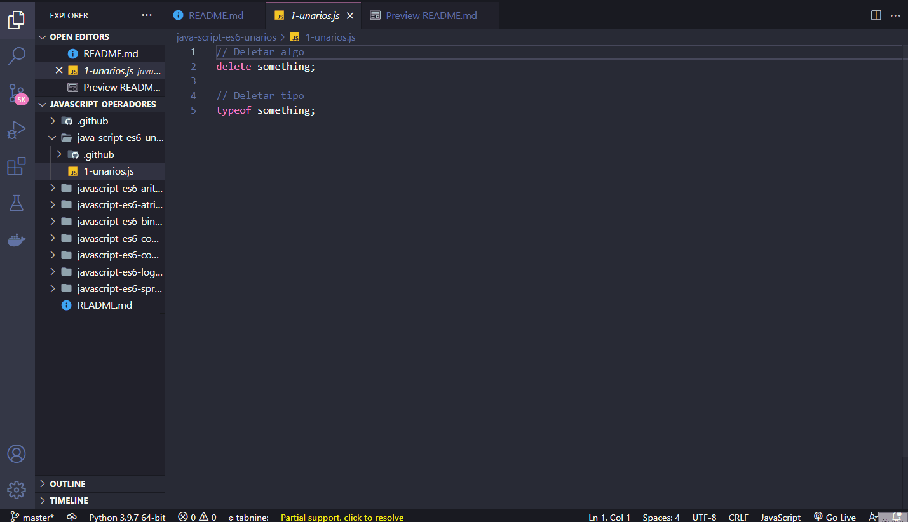
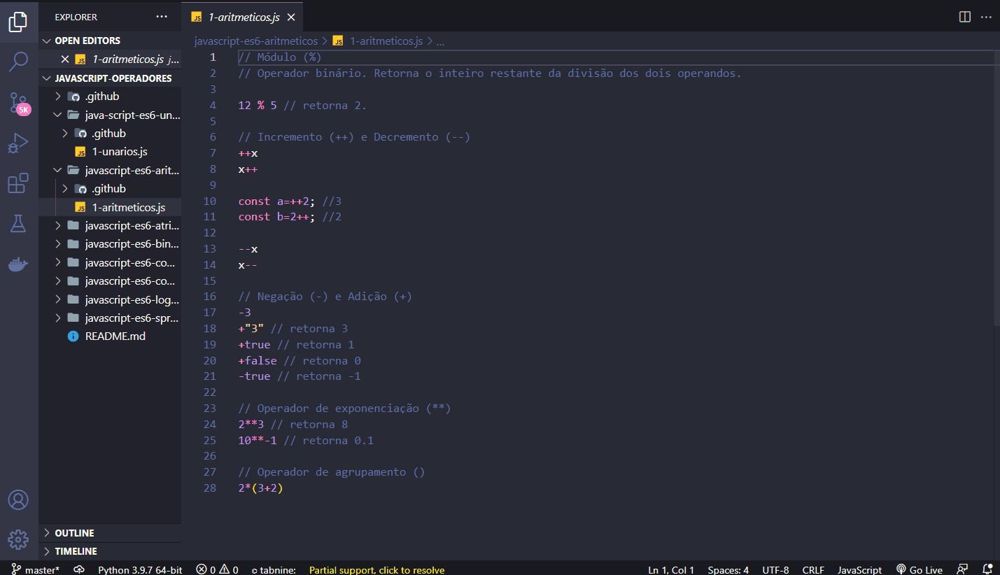
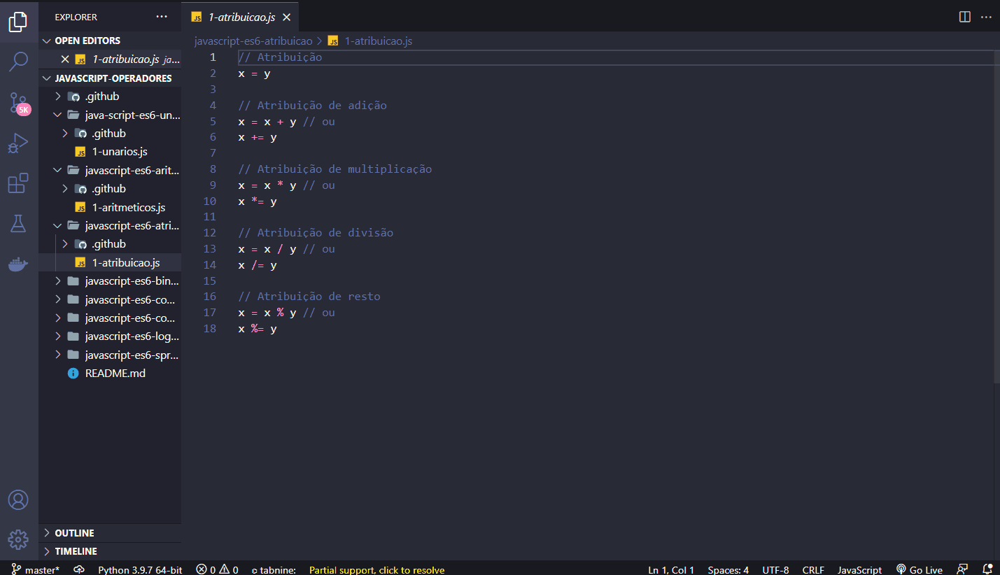
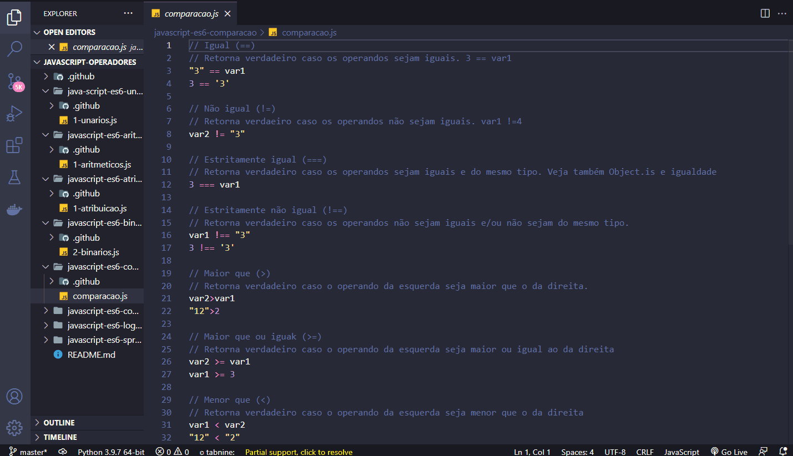
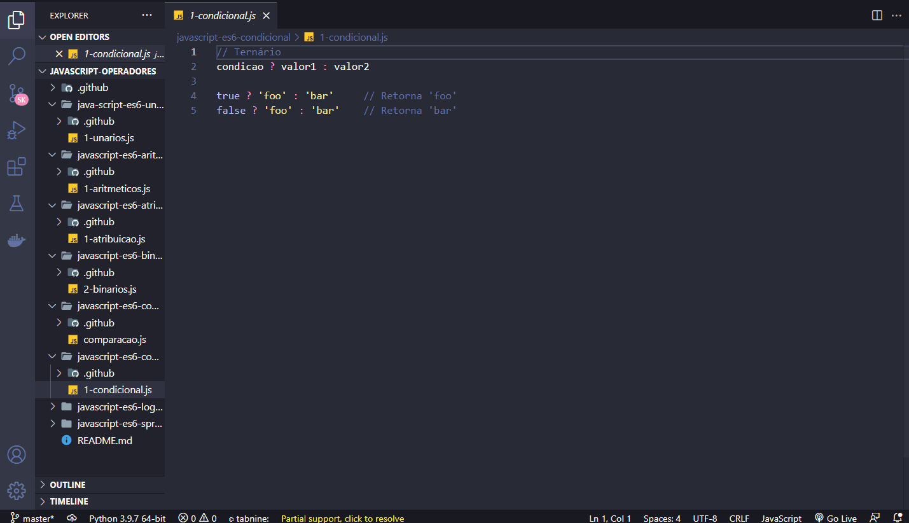
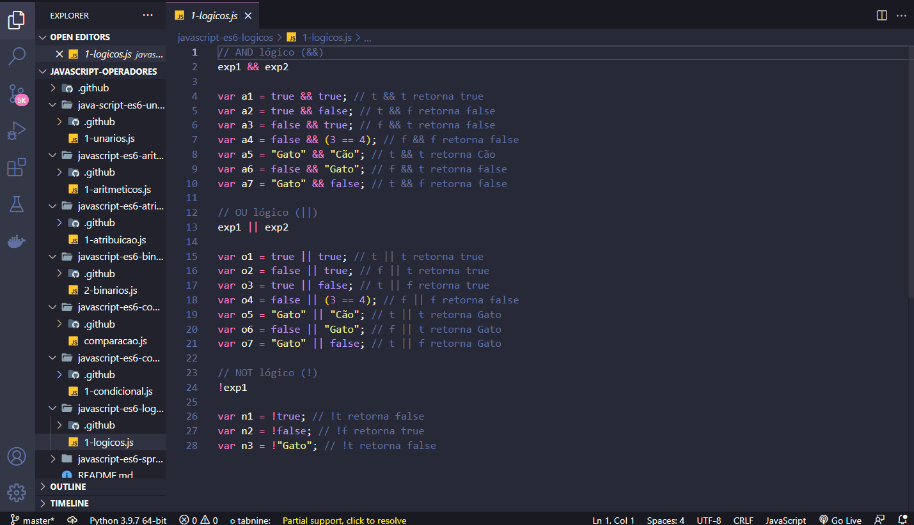
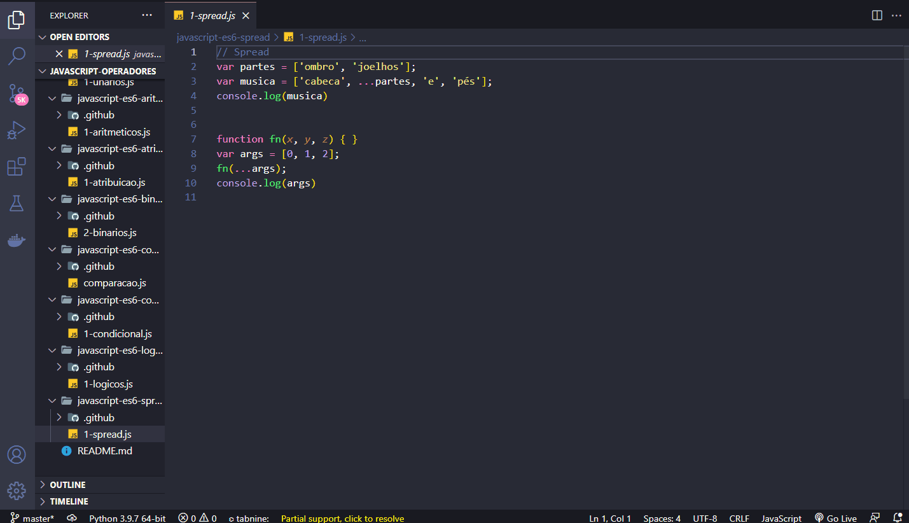

<h1 align="center">
  
   
  JavaScript ES6 - Operators
</h1>

<h3 align="justify">
Didactic demonstration of the main JavaScripty ES6 operators. Credits for the Digital Innovation One Essential ES6 JavaScript module.
</h3>

 

## 📷 Demonstration

<h4 align="left"> Unarios </h4>
  
   
<h4 align="left" > Aritmeticos </h4>  
  
   
<h4 align="left"> Atribuição </h4>
  
   
<h4 align="left"> Binarios </h4>
  
   
<h4 align="left"> Comparação </h4>
  
   
<h4 align="left"> Condicional </h4>
  
     
<h4 align="left"> Lógicos </h4>
  
     
<h4 align="left"> Spread </h4>
  

 

## 🚀 Technologies

This project was developed with the following technologies:

- JavaScript ES6

 

## ⚙ Operators
- unarios
- aritmeticos
- atribuição
- binarios
- comparação
- condicional
- lógicos
- spread

 

---

Made with 💜 by Rafael Maciel
